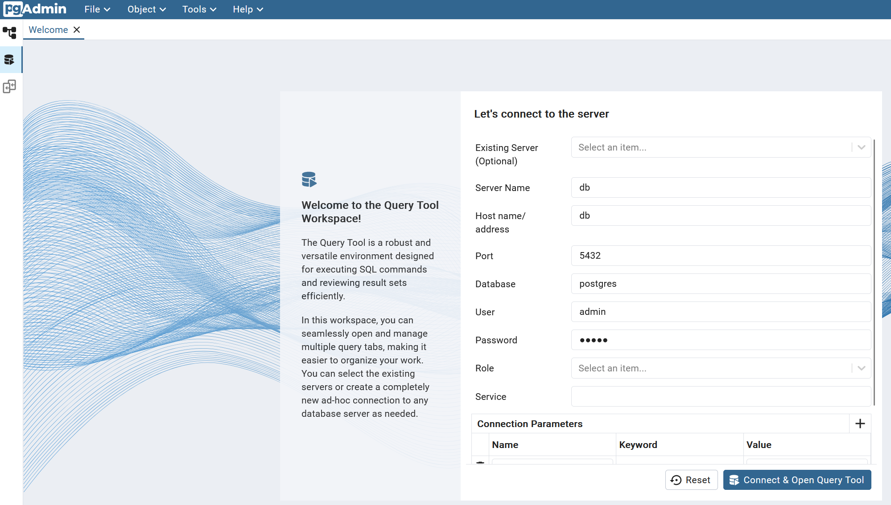

# Getting Started

## Prerequisites
Following guide assumes Docker has been installed - this is required for the Postgres database, and PGAdmin GUI
Additionally, a python virtual environment is recommended
Repo has been cloned:
```
git clone https://github.com/mkdigi-hash/customer-journey-demo.git
```

## Postgres Setup
### Docker Compose and Environment Variables
Data is hosted in a Postgres database, which can be setup together as part of the same service using docker-compose.

You'll notice in the `compose.yaml` that some environment variables are used, these should be stored in a .`env` file of identical structure to the `example_dotenv` file.

Once the `.env` file is created, from the repo's root directory, run:
```
docker-compose up --build -d
```

check the two services are running using `docker ps`. If yes, then try access PGAdmin. Assuming locally hosted:
`http://127.0.0.1:15080`

### Accessing and Connecting to the Database via pgAdmin
Use the login credentials from the `.env` file (`$PGADMIN_DEFAULT_PASSWORD` and `$PGADMIN_DEFAULT_EMAIL`)

Once logged in, navigate to the Query Tool Workspace on the left (looks like a database symbol with a triangle). You'll be prompted with a connection page. Refer to the `.env` file for these, using the variables for the actual database (not PGAdmin). Should look something like below.

Note also, since we're using docker compose, these services are on the same 'network', which allows us to use `db` (which if you check the `compose.yaml`, you'll see is the service name)



Additionally, using the same connection details, you can register the server via the Defaul Workspace tab (looks like the shcema tree symbol) - doing this will allow you to see the schema, tables etc in the dropdown list.

### Configure tables
Simply paste the table DDL files in the `data-generation/` directory into the query workspace and run.


## Data Generation
Python version used is `3.12.3`. It is recommended to use a virtual environment. From the root directory and with the venv active, run `pip install requirements.txt`

Once ready, simply run:
`python data-generation/database_update.py`
this refers to the `wafer_probe_results` table.

### Specifying timeframes and data volumes
The script will generate a specified number of lots (batches), each containing a certain number of wafers, which have a certain number of die (noted by an xy coordinate on each wafer).
Default example will generation 1 lot (batch) with 5 wafers each. The size of the die shouldn't need to be adjusted.
```
# Configuration
NUM_LOTS = 1
WAFERS_PER_LOT = 5
```

In the `if __name__ == "__main__"` check at the end of the script, the timeframe can be configured:
```
if __name__ == "__main__":
    start_offset = 0 # number of days from today to start test
    end_offset = 30 # number of days from today to end test, inclusive of last day
    for day_offset in range(start_offset, end_offset + 1):  # Simulates tests over range of days
        print(f"\n=== Simulating Day {day_offset + 1} ===\n")
        stream_probe_data(day_offset)
        #time.sleep(1)  # Optional delay between days
```

The default is 30 days of data, can be adjusted by updating these.

### Simulating data failures
A crude way to generate some failed data points was using two functions, `generate_measure_value()` and `generate_measure_value_fails()`. This is messy, ideally should be handled in one function. But works for now. However when you wish to generate a period of higher failures, these functions need to be swapped out manually in the `stream_probe_data()` function.

### HR Database
A simple factory staffing table was setup to record staffing levels on the factory floor. The idea was to manually corelate the test failure periods to periods of lower staffing levels. Main purpose here is to be able show some basic statistical analysis to highlight trends between staffing levels and product/testing quality. 

Regarding fault detection, this can easily be substituted for any other correlation, such as machine parameters used in an earlier process (mapped via the `lot_id`).